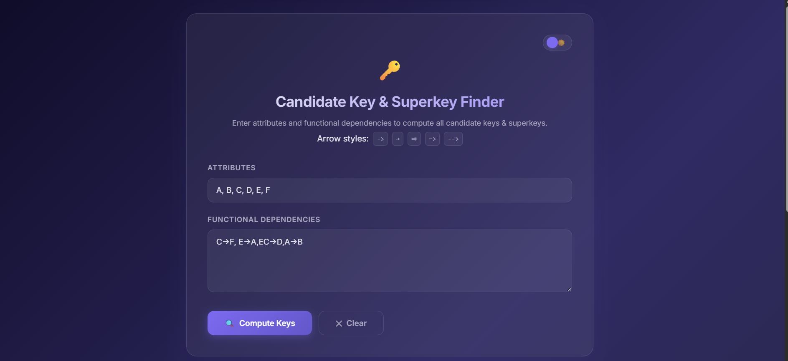
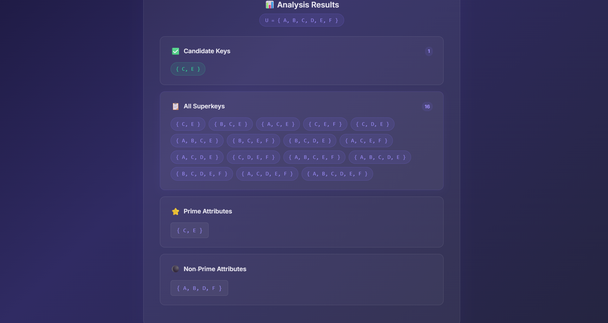

# 🔑 Candidate Key & Superkey Finder

A web-based tool to compute **candidate keys**, **superkeys**, **prime attributes**, and **non-prime attributes** from a set of attributes and functional dependencies (FDs). Built with Flask and a modern glassmorphism UI with dark/light mode.

---

## ✨ Features

- **Candidate Key Detection** — Finds all minimal superkeys (candidate keys) using attribute closure
- **Superkey Enumeration** — Lists every superkey by testing all subsets of the universal set
- **Prime / Non-Prime Classification** — Identifies which attributes appear in at least one candidate key
- **Flexible Input Parsing** — Supports multiple arrow styles: `->`, `→`, `⇒`, `=>`, `-->`
- **Smart Attribute Splitting** — Automatically splits `BC` into `{B, C}` when all attributes are single letters
- **Dark / Light Mode** — Toggle between themes; preference saved in localStorage
- **Responsive Design** — Works on desktop and mobile

---

## 🧠 How the Algorithm Works

### 1. Parse Attributes
User input like `A, B, C, D` is tokenized and normalized to uppercase. The **universal set** `U` is formed from these attributes plus any extras found in the FDs.

### 2. Parse Functional Dependencies
FDs like `A->BC, D->A` are split on commas. All arrow formats (`->`, `→`, `⇒`, `=>`, `-->`) are normalized to `->`. If all attributes are single characters, tokens like `BC` are automatically split into `{B, C}`.

### 3. Attribute Closure (X⁺)
For a given set of attributes `X`, the closure `X⁺` is computed by repeatedly applying FDs:

```
closure(X):
    result = X
    repeat until no change:
        for each FD (lhs → rhs):
            if lhs ⊆ result:
                result = result ∪ rhs
    return result
```

If `X⁺ = U` (the closure equals the full attribute set), then `X` is a **superkey**.

### 4. Find Candidate Keys & Superkeys
All subsets of `U` are generated in **increasing size order** (from empty set to full set):

```
for each subset X of U (smallest first):
    if closure(X) == U:
        X is a superkey
        if no existing candidate key is a proper subset of X:
            X is also a candidate key
```

- **Superkey** = any set whose closure is `U`
- **Candidate Key** = a superkey with no proper subset that is also a superkey (minimal superkey)

### 5. Prime & Non-Prime Attributes
- **Prime attributes** = union of all candidate keys
- **Non-prime attributes** = `U - prime`

---

## 📁 Project Structure

```
superkey/
├── app.py                  # Flask app entry point
├── config.py               # App configuration
├── requirements.txt        # Python dependencies
├── core/
│   ├── __init__.py
│   └── key_finder.py       # All algorithm logic (closure, find_keys, parsing)
├── routes/
│   ├── __init__.py
│   └── main.py             # Flask blueprint with the index route
├── static/
│   ├── css/
│   │   └── style.css       # Dark/light glassmorphism theme
│   └── js/
│       └── app.js          # Theme toggle, form clear, scroll behavior
├── templates/
│   ├── base.html           # Base layout (fonts, meta, CSS/JS links)
│   └── index.html          # Main page template
└── utils.py                # Legacy utility functions (kept for reference)
```

---

## 🚀 Getting Started

### Prerequisites

- Python 3.10 or higher

### Installation

```bash
# Clone the repository
git clone https://github.com/yourusername/superkey.git
cd superkey

# Install dependencies
pip install -r requirements.txt
```

### Run the App

```bash
python app.py
```

Open your browser and navigate to **http://127.0.0.1:5000**

---

## 📖 Usage Example

| Field | Input |
|---|---|
| **Attributes** | `A, B, C, D` |
| **Functional Dependencies** | `A->BC, D->A` |

### Results

| Output | Value |
|---|---|
| **Candidate Keys** | `{D}` |
| **Superkeys** | `{D}`, `{A, D}`, `{B, D}`, `{C, D}`, `{A, B, D}`, `{A, C, D}`, `{B, C, D}`, `{A, B, C, D}` |
| **Prime Attributes** | `{D}` |
| **Non-Prime Attributes** | `{A, B, C}` |

**Why?** `D⁺ = {D} → apply D→A → {A, D} → apply A→BC → {A, B, C, D} = U`. Since `D` alone determines all attributes and no single-attribute subset of `{D}` exists, `{D}` is the only candidate key.

---

## 🎨 UI Themes

The app supports **dark mode** (default) and **light mode**, toggled via the 🌙/☀️ switch in the top-right corner. Your preference is saved in the browser's localStorage.

---

## ⚠️ Limitations

- The algorithm enumerates **all 2ⁿ subsets** of the attribute set, so it works best for up to ~15-20 attributes. Beyond that, computation may be slow.
- FDs must be separated by **commas**. Semicolons and newlines in the textarea are treated as part of the same FD unless comma-separated.

---

## 📄 License

This project is open source and available under the [MIT License](LICENSE).

